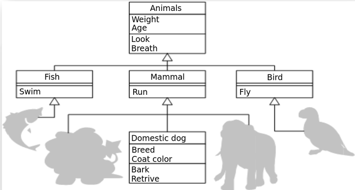

haah


# CZ_4079

Přihlášení na github pomocí jména a hesla nebo pomocí SSH

## Jak vytvořit ssh klíč


příkazem `ssh-keygen.exe`
- to mi vygeneruje v domovskásložka/.ssh soubory `id_rsa` a `id_rsa.pub`
- obsah `id_rsa.pub` vložíme na github-Settings-SSH a GPT keys

## Git nastavení user a hesla
`git config --global user.name "FIRST_NAME LAST_NAME"`
`git config --global user.email "example@email.com"`


## Úkol 1 - Kalkulačka

- Vytvořit github repo
- Naklonovat si to na PC
- napsat něco do readme.md, vytvořit commit a pushnout to
- dát do .gitignore `.idea`
- poslat do chatu URL na to repo
- udělat kalkulačku - zeptá se nás na první číslo, znaménko a druhé číslo (načítat lze pomocí `input()`)
- zacommitovat a pushnout

## Úkol 2 - Exception
- ošetřit vstup
- ošetřit dělení nulou
- vyvolejte vyjímku, pokud uživatel zadal nějaké jiné znaménko než je povolené

## Úkol 2 - Extra
- nekonečná kalkulačka - dokud nenapíšeme "konec", tak se nás kalkulačka stále ptá na další operace

## Task 1 - Calculator

- Create a GitHub repository.
- Clone it to your PC.
- Write something in readme.md, create a commit, and push it.
- Add `.idea` to `.gitignore`.
- Send the URL of the repository in the chat.
- Create a calculator:
- It should prompt the user for the first number, an operator, and the second number (using input()).
- Commit and push the changes.
- 
## Task 2 - Exception Handling

- Validate user input.
- Handle division by zero.
- Raise an exception if the user enters an operator that is not allowed.
- 
## Task 2 - Extra

- Infinite calculator - the calculator should keep asking for operations until the user types "end".

## Task 4 - Dědičnost tříd


Podle tohoto obrázku napsat třídy v Pythonu. Výsledek přidejte do nového souboru ve vašem repozitáři a zacommitujte.

Write classes in Python according to this diagram. Add the result to a new file in your repository and commit it."

## Task 5 - vícenásobné dědění
- Dvě třídy aby měli stejnou metodu.
- Jiná třída dědí od obou tříd.
- Instance jiné třídy zavolá onu metodu - z jaké třídy bude metoda vykonána?

ENG:
- Two classes should have the same method.
- Another class inherits from both classes.
- An instance of this other class calls that method - from which class will the method be executed?

## Task 6 - celková váha zvířát
- vycházíme z diagramu na obrázku výše
- při vytvoření zvířete, se přičte jeho váha k celkové váze (property `total_weight` u třídy Animals)
- (volitelně navíc) zvířata mají metodu `set_weight`
- když na konci programu napíšu `print(Animals.total_weight)`, tak se mi vypíše celková váha všech zvířat
- (volitelné navíc) všechna zvířata dám do listu (list = pole) a ve for cyklu vypíšu jejich váhu
- (volitelné navíc) Třídu Animals udělejte abstraktní a dejte jí abstraktní metodu `set_weight`. Jaký error nastane když budeme chtít vytvořit instanci Animals?

ENG:
- we start from the diagram in the image above
- when an animal is created, its weight is added to the total weight (property total_weight in the Animals class)
- (optionally) animals have a set_weight method
- at the end of the program, when I write print(Animals.total_weight), the total weight of all animals is displayed
- (optional) put all animals in a list and print their weight in a for loop
- (optional) make the Animals class abstract and give it an abstract method set_weight. What error will occur if we try to create an instance of Animals?

## Task 7 - deep copy budov
- Zkopírujte si obsah souboru [Task7.py](https://github.com/alifuk/CZ_4079/blob/main/Task7.py)
- Nad kód který tam je napište třídu `Budova`, které má metody `pridej_patro` a `get_copy`
- Metody správně implementujte
- Kód musí projít bez chyby

ENG:
- Copy the contents of the file [Task7.py](https://github.com/alifuk/CZ_4079/blob/main/Task7.py).
- Above the code in that file, write a class `Budova` with methods `pridej_patro` and `get_copy`.
- Implement methods
- The code must run without errors.

## Task 8 - decorator
- Přes debugger si prokrokujte celý [decorator_example.py](https://github.com/alifuk/CZ_4079/blob/main/decorator_example.py) příklad
- Udělejte screenshot, z nějakého kroku během debugu, a tento screenshot vložte do readme ve Vašem repozitáři. Jak vložit obrázek vidíte v tomto readme souboru

ENG
- Step through the entire [decorator_example.py](https://github.com/alifuk/CZ_4079/blob/main/decorator_example.py) example using a debugger.
- Take a screenshot at any point during debugging, and add this screenshot to the README in your repository. Instructions on how to insert an image are provided in the README file.

## Task 8b - password
- Napište dekorátor `@with_password`. Funkce, které tento dekorátor mají, se vykonají pouze, pokud uživatel správně zadá heslo (využijte input()).
- Napište dekorátor `@print_time`. Tento dekorátor vypíše, jak dlouho volaná funkce běžela.

Zastavení programu na sekundu a změření času:
```
import time
start = time.time()
time.sleep(1)
end = time.time()
print("Uplynulý čas {(end-start):.4f}")
```

ENG:
- Write a decorator @with_password. Functions with this decorator will only execute if the user correctly enters the password (use input() for this).
- Write a decorator @print_time. This decorator should print how long the called function took to run.

## Task 9 - úkolovník
 
Cílem úkolu je vytvořit poznámkový blok
V poznámkovém bloku můžeme přidávat, odebírat nebo měnit řádky.
Když spustíme program tak máme následující možnosti:
- Přidat poznámku (nakonec)
- Vypsat všechny poznámky
- Smazat poznámku (budeme vyzváni, jaký řádek smazat)
- Upravit poznámku (budeve vyzváni, jaký řádek a jak upravit)
- Uložit poznámky do souboru .csv (budeme vyzváni do jakého souboru) 
- Načíst poznámky ze souboru .csv (budeme vyzváni z jakého souboru)
- Pokud máte hotovo - uložení i přes pickle i JSON
- Pokud máte hotovo - nepoužívat funkce, ale vše vložit do třídy
- Pokud máte hotovo - ošetřit všechny vstupy - program nesmí spadnout při zadání libovolného vstupu


The goal of the task is to create a notebook application.
In the notebook, we can add, delete, or modify lines.
When we run the program, we have the following options:

Add a note (append it to the end)
Display all notes
Delete a note (we will be prompted for which line to delete)
Edit a note (we will be prompted for which line to edit and the new content)
Save notes to a .csv file (we will be prompted to specify the file name)
(Optional: Save notes using pickle as well)
Load notes from a .csv file (we will be prompted to specify the file to load from)


## Task 10
- v souboru Task10_context.py doplnit implementaci třídy tak, aby context měřil čas vnitřku bloku


